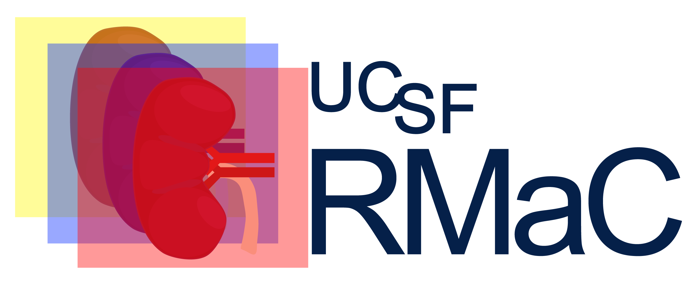

# UCSF-ProstateMR: The University of California - San Francisco (UCSF) Prostate MRI (UCSF-ProstateMR) Dataset



This dataset provides a large dataset of 973 prostate MRI exams performed between January 2016 to March 2019 of all patients that underwent subsequent MRI/ultrasound fusion biopsy within one year at UCSF. Each exam includes registered T2, ADC and high B value DWI as well as a contoured whole gland segmentation of the prostate gland, up to 4 lesion segmentations in the form of bounding boxes, and approximated sextant segmentations. Corresponding fusion biopsy and nontargeted sextant (i.e. systematic) biopsy results in the form of gleason score converted to an ISUP/Gleason grade (with “0” corresponding to benign result) as well as PI-RADS scores, PSA density, presence of endorectal coil, prostate volume, patient age, an anonymized patient identifier, and patient race are available. 


## Citations

<!--
### Dataset

```
Larson, P., Wang, Z. J., Sahin, S., Diaz, E., Rajagopal, A., Abtahi, M., Jones, S., Dai, Q., Kramer, S.
UCSF RMaC: UCSF Renal Mass CT Dataset.
UCSF Center for Intelligent Imaging (Ci2) Datasets for Medical Imaging.
https://imagingdatasets.ucsf.edu/dataset/3.  doi: 10.58078/C2WC74 (2025).
```
--> 

### Publications that used this dataset

```
Velarde N, Westphalen AC, Nguyen HG, Neuhaus J, Shinohara K, Simko JP, Larson PE, Magudia K. 
US lesion visibility predicts clinically significant upgrade of prostate cancer by systematic biopsy. 
Abdominal Radiology. 2022 Mar;47(3):1133-41. doi: 10.1007/s00261-021-03389-x
https://pmc.ncbi.nlm.nih.gov/articles/PMC8863714/
```

```
Rajagopal A, Redekop E, Kemisetti A, Kulkarni R, Raman S, Sarma K, Magudia K, Arnold CW, Larson PE. 
Federated learning with research prototypes: application to multi-center MRI-based detection of prostate cancer with diverse histopathology. 
Academic radiology. 2023 Apr 1;30(4):644-57. doi: 10.1016/j.acra.2023.02.012
https://pmc.ncbi.nlm.nih.gov/articles/PMC10869141/
```

```
Rajagopal A, Westphalen AC, Velarde N, Simko JP, Nguyen H, Hope TA, Larson PE, Magudia K. 
Mixed supervision of histopathology improves prostate cancer classification from MRI. 
IEEE transactions on medical imaging. 2024 Mar 28;43(7):2610-22. doi: 10.1109/TMI.2024.3382909
https://pmc.ncbi.nlm.nih.gov/articles/PMC11361281/
```

## Data Access (In Progress)

<!-- 
The dataset is hosted on AWS S3. It can be found at the following URIs:


The dataset can be downloaded directly by clickling on the following URLs:

https://imagingdatasets.ucsf.edu/dataset/3

https://registry.opendata.aws/ucsf-rmac/

Alternatively, the dataset can be downloaded via the AWS CLI:

1. Install [AWS CLI]("https://docs.aws.amazon.com/cli/latest/userguide/getting-started-install.html").
2. Copy using the S3 URI

```sh
aws s3 ls --no-sign-request s3://ucsf-rmac-dataset/
```

## File Structure of Dataset

All CT imaging data and associated metadata are organized in HDF5 container files named by patient ID (a 10 digit random alphanumeric code). A csv file is included as a key describing which phases are available for each subject and the registration status for each CT volume.

Within phase_reg_key.csv:

- 0 = no volume
- 1 = volume exists but is not registered to the unenhanced (noncon) volume
- 2 = volume exists and is registered to the unenhanced (noncon) volume

The file structure:

```sh
.
├── 08FBroxzI6.hdf5
├── 0A87Rq5Hkl.hdf5
├── 0ByGP3oWJi.hdf5
├── 0cb2z7Hao2.hdf5
...
├── phase_reg_key.csv
...
├── Zu1bNdA2od.hdf5
├── ZYUz7t5hOn.hdf5
└── Zz99Ji2swU.hdf5
```

Within a HDF5 container file, the CT volumes are organized as follows:

```sh
└── Zz99Ji2swU.hdf5
   ├── attrs
   ├── arterial
   ├── delay
   ├── mask
   ├── noncon
   └── portven
```

The attributes includes selected metadata and image labels.

The HDF5 files can be read in Python using the [H5py package](https://docs.h5py.org/en/latest/quick.html). For example, to print the containers and atrributes and extract the unenhanced (noncon) CT volume in a HDF5 file:

```python
import h5py
with h5py.File("Zz99Ji2swU.hdf5", "r") as hdf:
    print(f"HDF5 file datasets: {list(hdf.keys())}")
    print(f"HDF5 file attributes: {list(hdf.attrs.keys())}")
    noncon = hdf["noncon"][:]
    print(f"Shape of noncon volume: {noncon.shape}")
```

Output:

```sh
HDF5 file datasets: ['arterial', 'delay', 'mask', 'noncon', 'portven']
HDF5 file attributes: ['Manufacturer', 'PID', 'Patient Age', 'Patient Sex', 'arterial_pixdim', 'delay_pixdim', 'mask_pixdim', 'noncon_pixdim', 'pathology', 'pathology_grade', 'portven_pixdim', 'tumor_type']
Shape of noncon volume: (512, 512, 49)
```

## Tutorials

- [Label Exploration](tutorials/labelexploration.ipynb)
  - Explore the pathology labels across all the datasets and plot distributions

- [Tumor Mask Overlays](tutorials/maskoverlays.ipynb)
  - Visualize slices of the CT volumes and overlay tumor mask on

## Data Curation

Curation jupyter notebooks are collected in /curation and are numbered 01-07 to indicate each step of curation process.

A sample conda environment can be found in `environment.yml`

`curation/utils.py` -- contains utility functions for the curation steps
--> 

## Contributors

Project initiation and leadership - Kirti Magudia, MD, Peder Larson, PhD, and Antonio Westphalen, MD

Dataset Extraction - Kirti Magudia, MD

Curation - Kirti Magudia, MD, Nathan Velarde, Jeffry Simko, MD PhD, Hao Ngyuen, MD PhD

Data Management - Kirti Magudia, PhD, Abhejit Rajagopal, PhD
